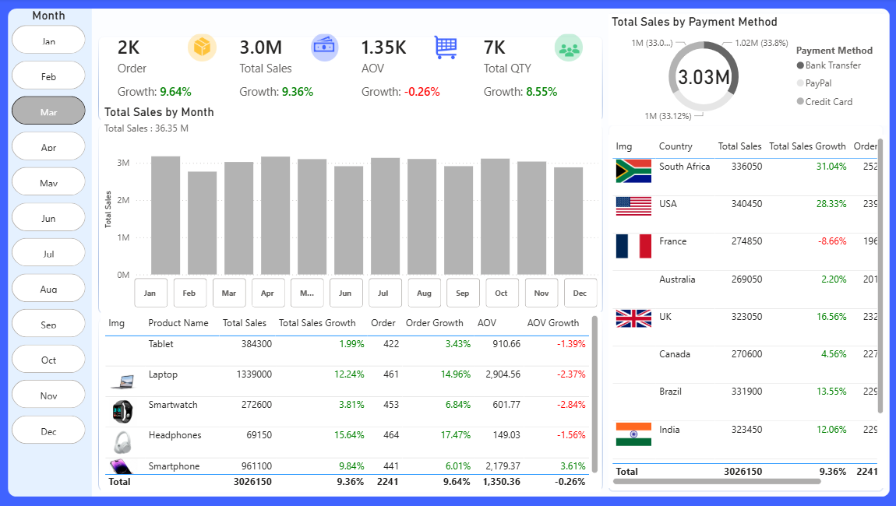

# 📊 Ecommerce Sales Dashboard

An interactive Power BI dashboard designed to analyze ecommerce sales performance and provide actionable business insights through dynamic visualizations and KPIs.

---

## 🚀 Project Overview

This dashboard helps track and monitor:

- Total Sales
- Orders & Quantity
- Average Order Value (AOV)
- Sales Growth
- Order Growth
- Performance by Country
- Product Performance
- Payment Method Analysis
- Monthly Sales Trends

The dashboard enables data-driven decision-making by transforming raw ecommerce data into clear and interactive insights.

---

## 🛠️ Tools & Technologies

- Power BI
- Power Query
- DAX
- Data Modeling
- Excel / CSV Dataset

---

## 📌 Dashboard Features

- Interactive monthly slicer
- KPI Cards with growth indicators
- Sales trend analysis by month
- Country-wise sales comparison
- Product performance table
- Payment method distribution
- Clean and modern dashboard design

---

## 📈 Key Insights

- Identify top-performing products.
- Monitor revenue growth trends.
- Compare sales across countries.
- Analyze payment method usage.
- Track order and AOV performance.

---

## 📷 Dashboard Preview

## 👩‍💻 Author

**Zeina Abdullah**  
*Junior Data Analyst | Power BI Developer*

